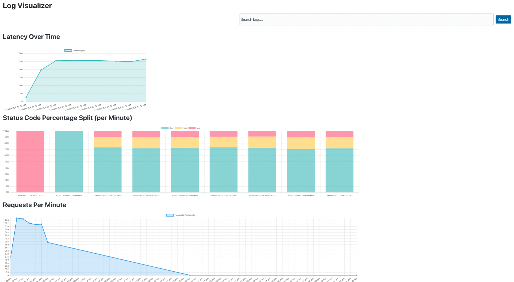
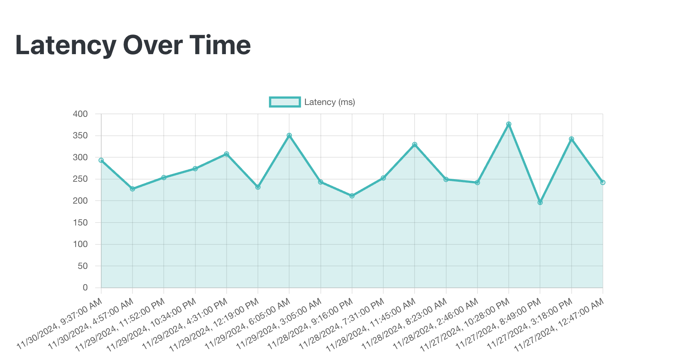
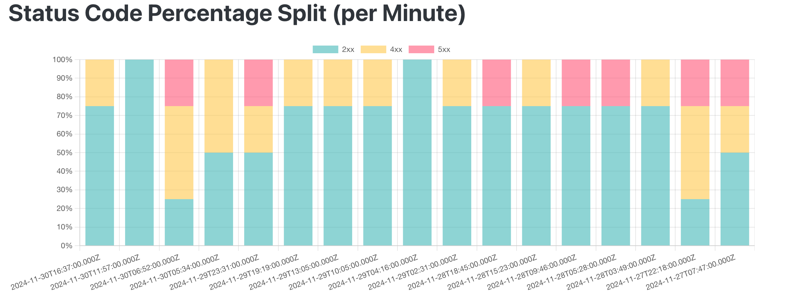
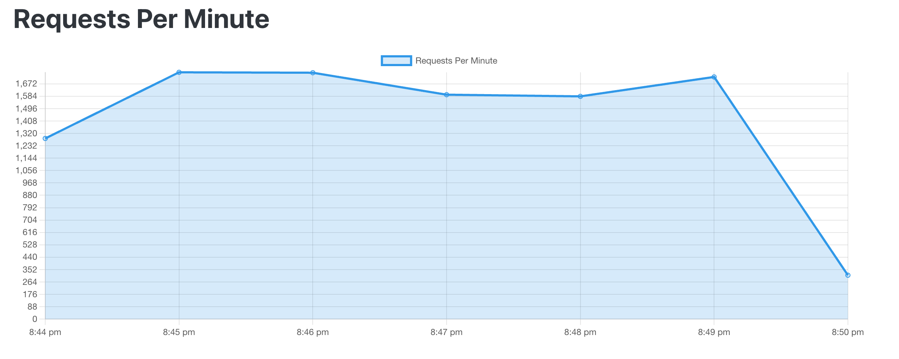
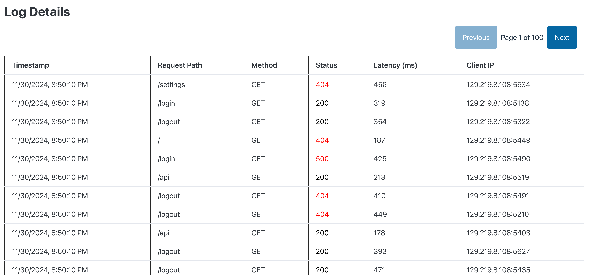
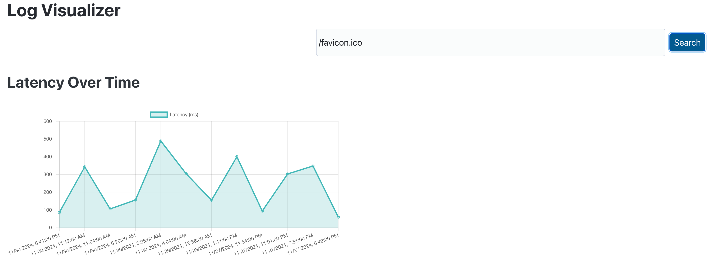
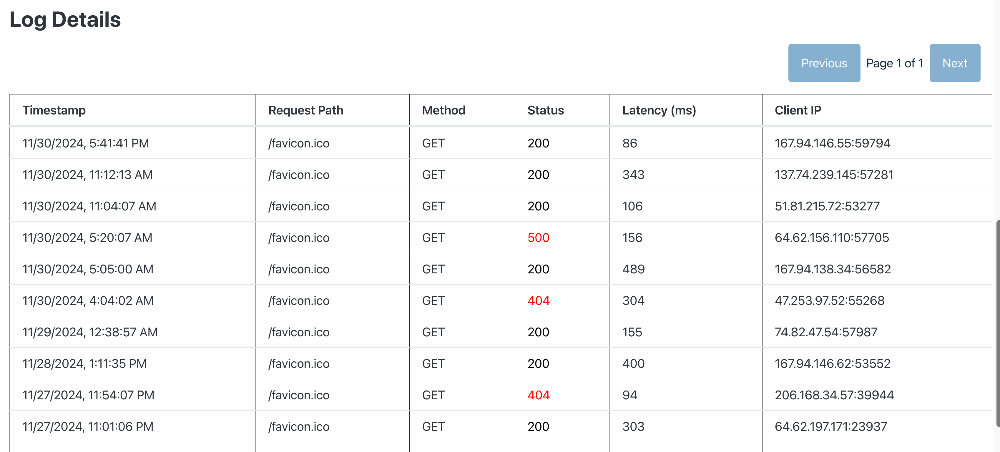

# log-visualizer
Visualize and search software logs in one place.

Features: 
- Query logs with fuzzy search
- Aggregation from multiple source(multiple servers)
- Visualize key metrics for understanding.
- Uses ElasticSearch with Filebeat extension, so minimal changes needed to you server log configuration

### Overview

### Latency Graph(time series)

### Status Code Split(time series)

### Requests Per minute(time series)

### Logs

### Fuzzy search with search result visualization

